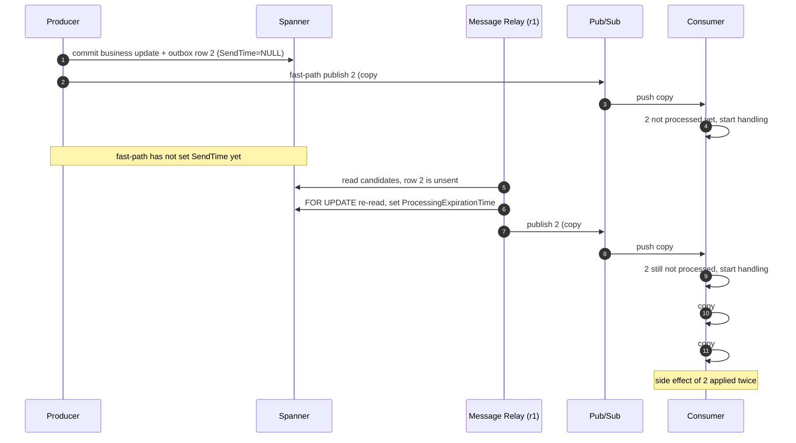

# Transactional Outbox

A model of a transactional outbox with a fast-path publish and a polling Message Relay as the fallback, on Spanner and Pub/Sub.
It checks that messages are never lost and that duplicate delivery is absorbed by the consumer.

All commands below are run from the repository root.
See the [root README](../README.md) for setup.

## What is modeled

Each step where a real process can fail or be interleaved is a separate action.
A Spanner transaction or a single mutation is one atomic action.

| Component | Actions |
|---|---|
| Producer | `produce` (business update + outbox row in one Tx), `fastPublishWith`, `fastMarkSentWith` |
| Message Relay | `relayStart` (read candidates per shard), `relayClaim` (`FOR UPDATE` re-read + set `ProcessingExpirationTime`), `relayPublishWith`, `relayMarkSentWith`, `relayCrash` |
| Operations | `ttlDelete`, `manualResend` |
| Consumer | `receive`, `finish`, `nack` |
| Time | `tick` |

Publish and mark-sent can fail at any point (`ok = false`), relays can run concurrently and crash, and time can pass while a publish is in flight, so leases can expire mid-publish.

## Properties

| Invariant | Meaning |
|---|---|
| `atomicCommit` | A business update and its outbox row always exist together |
| `sentImpliesAccepted` | A row with `SendTime` set was accepted by Pub/Sub at least once |
| `noLostMessage` | Every committed message is still in the outbox or was accepted by Pub/Sub |
| `effectsAtMostOnce` | Each message's side effect is applied at most once, even with duplicate delivery |

`safety` is all four combined.

## Modules

| Module | Purpose |
|---|---|
| `outboxAtomic` | Consumer checks "already processed" and applies the effect atomically |
| `outboxNonAtomic` | Consumer checks, then applies in a separate step |
| `outboxStarvation` | Tests for the known limitation with permanently failing rows |

## 1. Simulate

```sh
quint run outbox/outbox.qnt --main=outboxAtomic --invariant=safety \
  --max-samples=20000 --max-steps=30 \
  --witnesses duplicateDelivery ttlDeleted allProcessed
```

Expected: no violation.
The witnesses show that the runs actually reach duplicate delivery, TTL deletion and full processing.

```sh
quint run outbox/outbox.qnt --main=outboxNonAtomic --invariant=safety \
  --max-samples=20000 --max-steps=30
```

Expected: `error: Invariant violated`.
Two copies of the same message (for example, one from the fast-path and one from the relay after `SendTime` failed to update) both pass the "already processed" check before either records it, so the side effect runs twice.
The consumer's idempotency must be atomic, for example by writing the processed ID in the same transaction as the side effect.

The shortest counterexample, found by `quint verify` (9 steps), needs no failure at all.
The relay picks up the row in the window between the fast-path publish and its `SendTime` update, so duplicates happen during normal operation too:

```sh
quint verify outbox/outbox.qnt --main=outboxNonAtomic --invariant=effectsAtMostOnce --max-steps=12
```



## 2. Verify

```sh
quint verify outbox/outbox.qnt --main=outboxAtomic --invariant=safety --max-steps=8
```

Expected: `[ok] No violation found`.
This checks every execution up to 8 steps and takes about 3 minutes.

## 3. Starvation by permanently failing rows

```sh
quint test outbox/outbox.qnt --main=outboxStarvation
```

- `starvationTest`: a row whose publish always fails is the oldest in its shard.
  When the Scheduler interval is at least the lease, the lease has always expired by the next run, so the failing row is picked every time and the healthy row behind it is never published.
- `shortIntervalTest`: when a run starts while the failing row's lease is still active, the healthy row becomes a candidate.

So the limitation in the design shows up when the Scheduler interval is at least the lease duration, which is the case in the design (both 1 minute).
